<p align="center">
  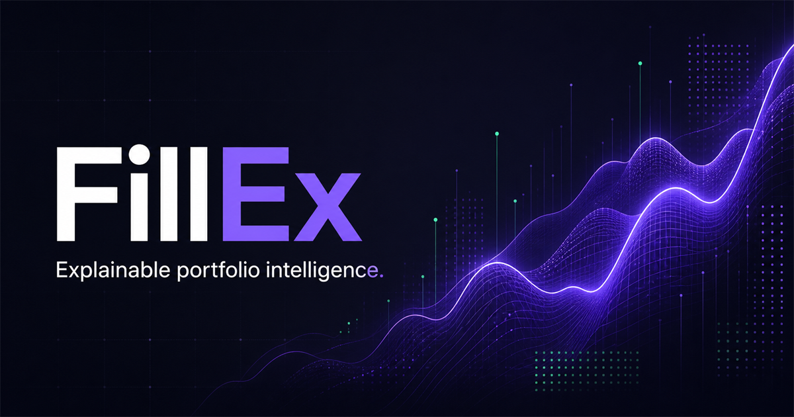
</p>

<h1 align="center">📈 FillEx — Autonomous Financial Intelligence Operating System</h1>

<p align="center">
  <strong>Production-Grade AI-Powered Personal Financial Intelligence Platform for Indian Retail Investors.</strong><br />
  <em>Know what changed. Know why it happened. Know why it matters to your portfolio.</em>
</p>

<p align="center">
  <a href="#-core-vision--problem-statement"></a>
  <a href="#-supported-broker-integrations"></a>
  <a href="#-regulatory--filings-intelligence"></a>
  <a href="#-multi-agent--rag-intelligence-engine"></a>
  <a href="#-security-privacy--reliability-model"></a>
  <a href="#-production-readiness--status"></a>
</p>

<p align="center">
  
  
  
  
  
  
  
  
</p>

---

## 📑 Table of Contents

- [🧠 Core Vision & Problem Statement](#-core-vision--problem-statement)
  - [The Decision-Intelligence Gap in India](#the-decision-intelligence-gap-in-india)
  - [Core Product Philosophy](#core-product-philosophy)
- [⚡ 90-Second Product Walkthrough](#-90-second-product-walkthrough)
- [✨ Core Capabilities Summary](#-core-capabilities-summary)
- [🏛️ Complete System Architecture](#️-complete-system-architecture)
- [🔌 Supported Broker Integrations](#-supported-broker-integrations)
  - [1. Zerodha Kite Connect Integration](#1-zerodha-kite-connect-integration)
  - [2. Groww Trade API Integration](#2-groww-trade-api-integration)
  - [3. Upstox OAuth 2.0 Integration](#3-upstox-oauth-20-integration)
  - [4. Angel One SmartAPI Integration](#4-angel-one-smartapi-integration)
  - [5. Multi-Broker Portfolio Aggregation](#5-multi-broker-portfolio-aggregation)
  - [6. Manual Portfolio Fallback](#6-manual-portfolio-fallback)
- [🔍 Automatic Portfolio Discovery & Security Master](#-automatic-portfolio-discovery--security-master)
  - [Canonical Identity Resolution](#canonical-identity-resolution)
  - [Expandable Ingestion Pipeline](#expandable-ingestion-pipeline)
  - [“Fetching in a While” Non-Blocking UX](#fetching-in-a-while-non-blocking-ux)
- [📊 Market, Fundamentals & Regulatory Intelligence](#-market-fundamentals--regulatory-intelligence)
  - [1. Live & Historical Market Data](#1-live--historical-market-data)
  - [2. Financial Fundamentals & Statements](#2-financial-fundamentals--statements)
  - [3. SEBI Filings & Regulatory Processing](#3-sebi-filings--regulatory-processing)
  - [4. NSE & BSE Disclosures](#4-nse--bse-disclosures)
  - [5. Company Documents & Annual Reports](#5-company-documents--annual-reports)
  - [6. News Intelligence & Sentiment Radar](#6-news-intelligence--sentiment-radar)
  - [7. Corporate Actions Tracker](#7-corporate-actions-tracker)
- [🤖 Multi-Agent & RAG Intelligence Engine](#-multi-agent--rag-intelligence-engine)
  - [Evidence-First RAG Architecture](#evidence-first-rag-architecture)
  - [5 Specialized Domain Agents](#5-specialized-domain-agents)
  - [Specialized Agent Contracts](#specialized-agent-contracts)
  - [Real-World Intelligence Scenarios](#real-world-intelligence-scenarios)
- [🎨 Gen-Z UI/UX Design & Product Surfaces](#-gen-z-uiux-design--product-surfaces)
  - [Route Map](#route-map)
  - [Live Portfolio Dashboard Layout](#live-portfolio-dashboard-layout)
  - [Stock Intelligence Screen Layout](#stock-intelligence-screen-layout)
  - [Portfolio Intelligence Cards](#portfolio-intelligence-cards)
- [⚙️ Asynchronous Background Processing & Queue](#️-asynchronous-background-processing--queue)
- [🗄️ Database Architecture & Data Model](#️-database-architecture--data-model)
- [🛡️ Security, Privacy & Reliability Model](#️-security-privacy--reliability-model)
- [🌐 REST API Architecture](#-rest-api-architecture)
- [🧩 Extensibility: Adding a New Broker](#-extensibility-adding-a-new-broker)
- [📂 Project Directory Structure](#-project-directory-structure)
- [🚀 Quickstart & Local Setup](#-quickstart--local-setup)
- [🔐 Environment Configuration](#-environment-configuration)
- [🏁 Production Readiness & Status](#-production-readiness--status)
- [⚖️ Responsible Use & Disclaimers](#️-responsible-use--disclaimers)

---

## 🧠 Core Vision & Problem Statement

### The Decision-Intelligence Gap in India

India does not have a financial data shortage — it has a severe **decision-intelligence gap**:

> [!IMPORTANT]
> - **89%** of Indian retail F&O participants lose money.
> - India added **130 million** retail investors in four years.
> - Roughly **80%** of those new investors are under the age of 30.

Retail investors are forced to assemble a fragmented mosaic across broker apps, trading terminals, exchange circulars, SEBI disclosures, PDF annual reports, investor presentations, news feeds, and social media.

```text
Traditional Portfolio Tracker:
"What do I own?"  (Static list of tickers + P&L)

FillEx Financial Intelligence Operating System:
"What do I own?"
        +
"What is happening across markets, news, and regulators?"
        +
"Why is it happening?"
        +
"How does this specific event impact MY exact holdings and capital?"
        +
"What actionable evidence should I pay attention to right now?"
```

**FillEx turns the portfolio into the query.** Instead of forcing users to manually search for companies and assemble disparate data, FillEx connects to their broker, identifies their canonical holdings, and continuously generates evidence-grounded intelligence.

---

### Core Product Philosophy

1. **Portfolio First**: The user's actual holdings dictate what information matters. Intelligence is filtered, weighted, and prioritized by user exposure.
2. **Automatic Discovery**: Zero manual stock-list curation. Any new purchase on a broker automatically spins up deep-tier ingestion jobs.
3. **Multi-Source Truth**: Authoritative official regulators (SEBI, NSE, BSE) take precedence over open-source research and aggregators.
4. **Evidence-Backed AI**: Zero hallucinations. Every AI conclusion cites exact sources, document IDs, timestamps, and page numbers.
5. **Continuous Intelligence**: The platform operates in the background, updating intelligence feeds in real time as market events unfold.

---

## ⚡ 90-Second Product Walkthrough

1. **Sign in to FillEx**: Secure user authentication establishes a private session.
2. **Connect Broker Accounts**: Choose from **Zerodha Kite**, **Groww**, **Upstox**, or **Angel One**.
3. **Instant Token Vaulting**: Credentials and access tokens are immediately encrypted with **AES-256-GCM** using random initialization vectors.
4. **Automated Discovery & Ingestion**: FillEx imports holdings, normalizes instruments using **ISIN-first canonical IDs**, and triggers background enrichment jobs for newly discovered securities.
5. **Unified Dashboard**: View unified positions with weighted buy averages and multi-broker provenance.
6. **Real-Time Intelligence Feed**: Access AI-generated explanations ("Why is INFY moving?"), corporate action alerts, and SEBI filing summaries with exact citations.
7. **Ask FillEx AI**: Query your portfolio in natural language (*e.g., "How does the latest crude oil price hike impact my holdings?"*).

---

## ✨ Core Capabilities Summary

| Area | Feature | Status | Description |
|---|---|:---:|---|
| 🔐 **Authentication** | Unified Identity System | ✅ Operational | Stable user sessions with encrypted credential isolation. |
| 🏦 **Broker Ingestion** | Multi-Broker Gateway | ✅ Operational | Native read-only connectors for **Groww, Upstox, Angel One, and Zerodha**. |
| 🛡️ **Vault Security** | AES-256-GCM Encryption | ✅ Operational | All tokens and secrets encrypted with unique IVs; zero client-side leakage. |
| 🧭 **Security Master** | ISIN-First Canonical ID | ✅ Operational | Resolves tickers across brokers, NSE, BSE, and market data providers. |
| ⚡ **Market Ingestion** | Live & Historical Feed | ✅ Operational | LTP, OHLC, intraday, multi-timeframe candles with explicit freshness labels. |
| 📜 **Regulatory Filings**| SEBI / NSE / BSE Pipeline | ✅ Operational | Ingests corporate actions, disclosures, quarterly results, and official filings. |
| 📑 **Document RAG** | Vector Knowledge Base | ✅ Operational | PDF/XBRL extraction, semantic chunking, and verifiable vector citations. |
| 🤖 **Multi-Agent AI** | 5 Specialized Synthesizers | ✅ Operational | Parallel agents for market signals, news sentiment, regulatory risk, and portfolio impact. |
| 📱 **Gen-Z UI** | Modern Responsive UX | ✅ Operational | Dark-mode glassmorphic interface with interactive charts and portfolio cards. |

---

## 🏛️ Complete System Architecture

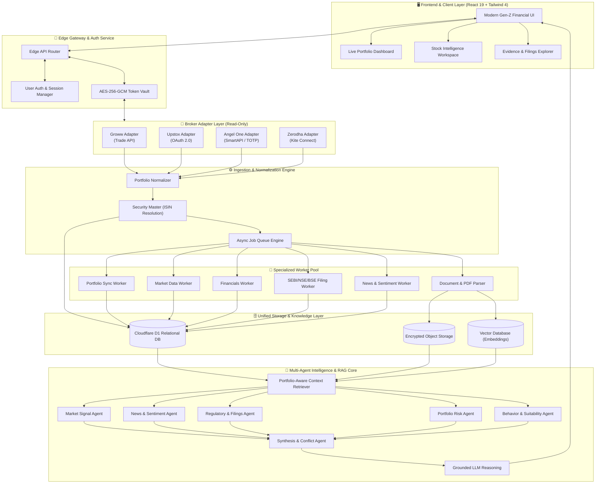

---

## 🔌 Supported Broker Integrations

FillEx uses a decoupled **Broker Adapter Pattern** that isolates broker authentication, rate limiting, and schema variations while exposing a uniform interface to the portfolio and intelligence layers.

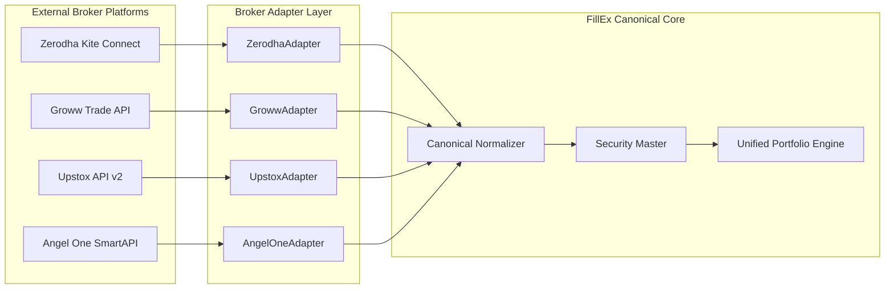

---

### 1. Zerodha Kite Connect Integration

Zerodha is integrated via the official **Kite Connect API**:
- **Authentication**: Initiates login redirect to `https://kite.zerodha.com/connect/login?v=3&api_key=...`.
- **Checksum Handshake**: On callback, computes `SHA-256(api_key + request_token + api_secret)` to exchange the temporary request token for an authorized access token.
- **Data Ingested**: Equity holdings, CNC/MIS positions, average buy prices, T1 quantity, and broker instrument tokens.
- **WebSocket Streaming**: Ready for live LTP and market depth ticks.

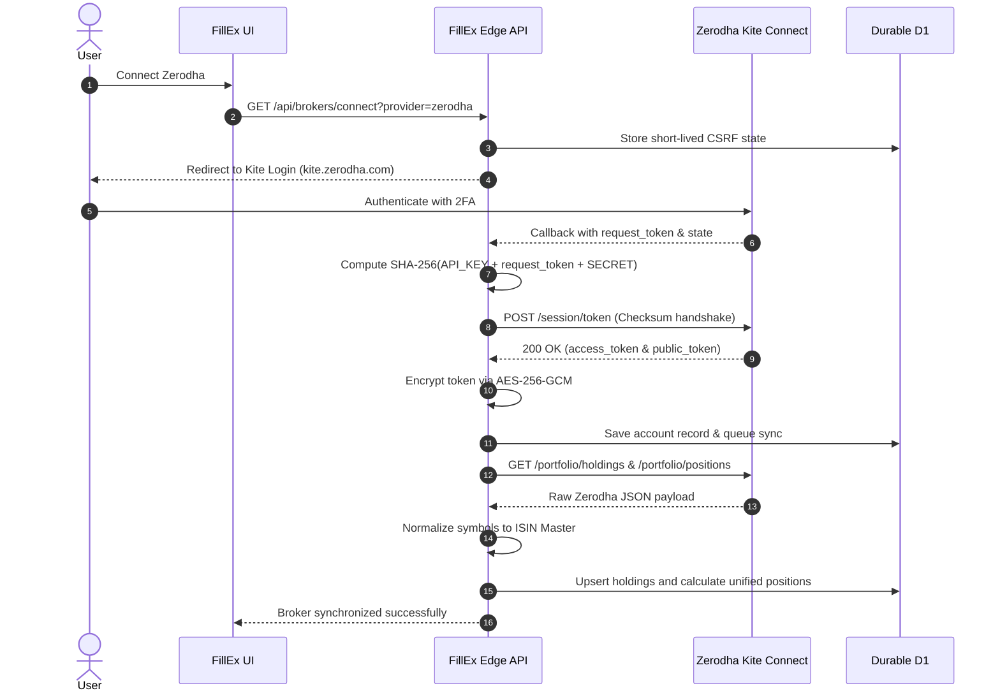

---

### 2. Groww Trade API Integration

Groww is integrated via its **Trade API** authentication model:
- **API Approval Flow**: Server-side access token generation using approved API key and secret.
- **Direct Token Alternative**: Supports direct entry of user-authorized access tokens.
- **Data Ingested**: Long-term equity holdings, open positions, daily P&L, and invested capital.
- **Auto-Renewal**: Automated session refresh handling.

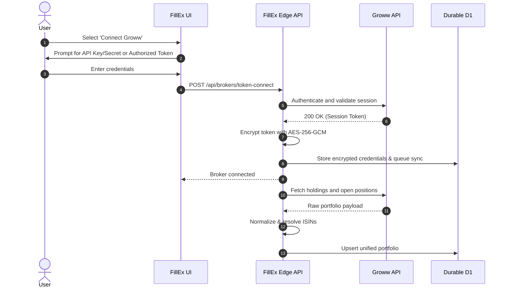

---

### 3. Upstox OAuth 2.0 Integration

Upstox utilizes standard **OAuth 2.0 Authorization Code Grant**:
- Secure redirect flow with CSRF state verification.
- Backend authorization code exchange for access token.
- Retrieval of long-term holdings, positions, quantity, average price, and real-time market value.

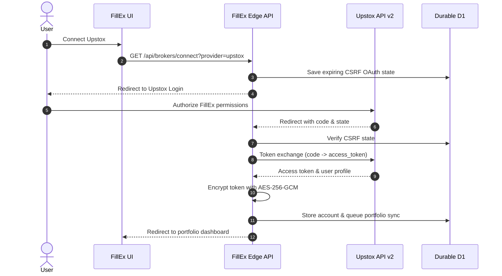

---

### 4. Angel One SmartAPI Integration

Angel One **SmartAPI** connection handles:
- Client Code, MPIN, and TOTP authentication.
- Issuance and renewal of JWT session tokens.
- Fetching equity holdings, open derivatives/cash positions, and instrument master tokens.

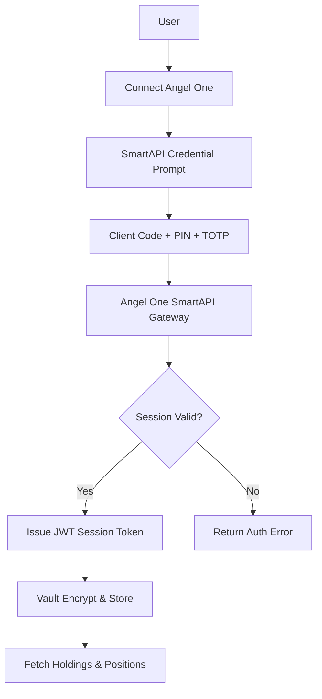

---

### 5. Multi-Broker Portfolio Aggregation

Users can connect multiple broker accounts simultaneously (*e.g., Groww for direct mutual funds & SIPs, Zerodha for long-term equity, Upstox for swing trades*).

```text
User Portfolio Provenance Example:
├── Groww Account
│   ├── INFY    -> 10 shares @ ₹1,420
│   └── TCS     -> 5 shares  @ ₹3,850
│
├── Zerodha Account
│   ├── TCS     -> 10 shares @ ₹3,920
│   └── HDFCBANK-> 30 shares @ ₹1,640
│
└── Upstox Account
    ├── INFY    -> 15 shares @ ₹1,480
    └── RELIANCE-> 20 shares @ ₹2,890

Canonical Unified View:
==================================================================================
Security   Total Qty   Weighted Avg Buy Price   Current Price   Unrealized P&L
----------------------------------------------------------------------------------
INFY       25 shares   ₹1,456.00               ₹1,820.30       +₹9,107.50 (+25.02%)
TCS        15 shares   ₹3,896.67               ₹3,910.00       +₹200.00 (+0.34%)
RELIANCE   20 shares   ₹2,890.00               ₹2,945.75       +₹1,115.00 (+1.93%)
HDFCBANK   30 shares   ₹1,640.00               ₹1,710.20       +₹2,106.00 (+4.28%)
==================================================================================
*Full broker-level provenance and source timestamps are preserved for auditability.*
```

---

### 6. Manual Portfolio Fallback

- Manual security lookup with quantity and average buy price entry.
- CSV file import with schema validation.
- Zero server-side leakage for browser-local records.
- Manually added securities enter the **exact same intelligence pipeline** as broker-discovered stocks.

---

## 🔍 Automatic Portfolio Discovery & Security Master

### Canonical Identity Resolution

Different brokers and market data providers use differing identifiers for the same asset. FillEx resolves every instrument into a canonical master entity using an **ISIN-first hierarchy**:

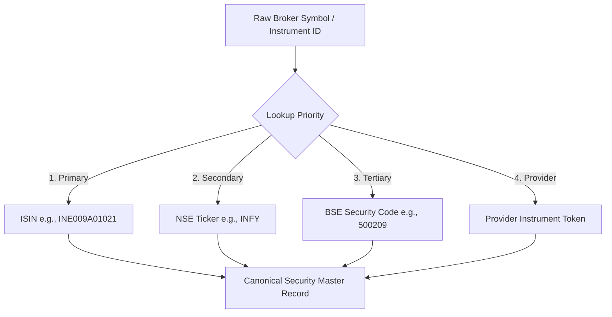

---

### Expandable Ingestion Pipeline

When a user buys a new stock (e.g., `DIXON`):

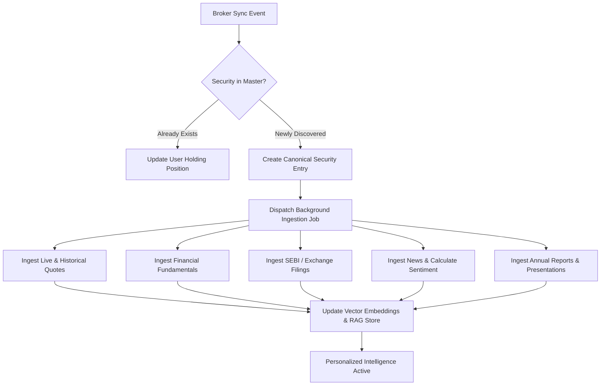

---

### “Fetching in a While” Non-Blocking UX

Ingestion happens asynchronously in the background. The user never waits on a blocking screen:

```text
DIXON Technologies (India) Ltd.
Status: Intelligence Pipeline Active

 [✔] Canonical Security Resolved (ISIN: INE935N01020)
 [✔] Portfolio Position Imported (10 shares @ ₹6,450)
 [✔] Live Market Data Stream Connected
 [✔] Ingested Financial Statements & Fundamentals
 [✔] Processed SEBI Filings & Disclosures
 [✔] Ingested Verified News & Sentiment Radar
 [✔] Vector Embeddings & RAG Context Ready
```

---

## 📊 Market, Fundamentals & Regulatory Intelligence

### 1. Live & Historical Market Data
- Real-time / snapshot LTP, OHLC, VWAP, 52-week high/low, intraday volume.
- Historical candlestick data spanning 1-day, 1-week, 1-month, 1-year, and 5-year horizons.
- **Strict Data Honesty**: Data is explicitly tagged as `LIVE`, `SNAPSHOT`, `DELAYED`, or `HISTORICAL`.

### 2. Financial Fundamentals & Statements
- Full balance sheets, profit & loss statements, cash flow statements.
- Normalized ratios: P/E, P/B, EV/EBITDA, ROE, ROCE, Debt-to-Equity, Operating Margin, Free Cash Flow Yield.

### 3. SEBI Filings & Regulatory Processing
- Official regulatory source monitoring (SEBI disclosures, insider trading reports, SAST declarations).
- Automated parsing of structured PDF/XBRL filings.

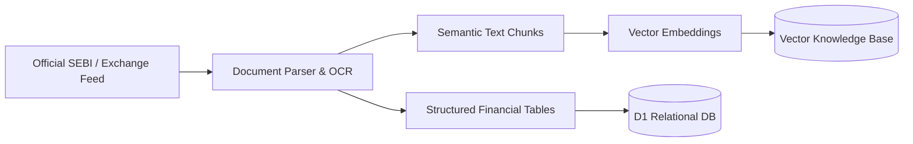

### 4. NSE & BSE Disclosures
- Real-time ingestion of corporate announcements, earnings release dates, board meetings, and exchange inquiries.

### 5. Company Documents & Annual Reports
- Processing of quarterly earnings call transcripts, investor presentations, and annual reports.

### 6. News Intelligence & Sentiment Radar
- Integration with verified financial news providers (Marketaux, NSE/BSE news feeds).
- Entity resolution to match articles to exact portfolio tickers.
- Noise filtering, deduplication, and portfolio impact scoring.

### 7. Corporate Actions Tracker
- Automated tracking of dividends (ex-date, record date, payout amount), stock splits, bonus shares, rights issues, buybacks, and mergers.

---

## 🤖 Multi-Agent & RAG Intelligence Engine

### Evidence-First RAG Architecture

FillEx utilizes an autonomous **5x Multi-Agent RAG Architecture** where specialized domain agents evaluate structured evidence contracts before synthesizing a unified, explainable answer:

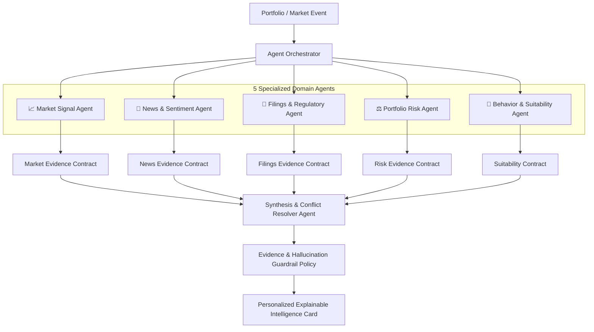

---

### 5 Specialized Domain Agents

1. **📈 Market Signal Agent**: Detects momentum shifts, volume anomalies, intraday volatility breakouts, and liquidity changes.
2. **📰 News & Sentiment Agent**: Matches news articles to portfolio tickers, computes entity-level sentiment scores, and clusters related stories.
3. **📜 Filings & Regulatory Agent**: Scans SEBI and exchange announcements, extracts material disclosures, and validates against structured financial statements.
4. **⚖️ Portfolio Risk Agent**: Evaluates portfolio concentration, sector risk, beta sensitivity, and capital-at-risk.
5. **👤 Behavior & Suitability Agent**: Tailors insight framing according to user risk preferences (Conservative, Balanced, Growth).

---

### Specialized Agent Contracts

Every agent communicates via a machine-checkable TypeScript schema:

```typescript
export interface AgentEvidenceContract {
  agent: 'market' | 'news' | 'filings' | 'risk' | 'behavior';
  securityId: string;
  isin: string;
  symbol: string;
  classification: string;
  direction: 'positive' | 'negative' | 'neutral' | 'unclear';
  confidenceScore: number; // 0.0 to 1.0
  portfolioImpact: 'high' | 'medium' | 'low' | 'neutral';
  timeHorizon: 'intraday' | 'near-term' | 'long-term';
  citations: Array<{
    source: string;
    sourceUrl?: string;
    publishedAt: string;
    documentId?: string;
    pageNumber?: number;
    chunkText?: string;
  }>;
  riskFlags: string[];
}
```

---

### Real-World Intelligence Scenarios

#### Scenario 1: Reliance Industries (RELIANCE) Drop Analysis
- **User Question**: *"Why is RELIANCE falling today and how does it affect me?"*
- **System Action**:
  1. Retrieves user holding: **20 shares @ ₹2,890** (Total value: ₹58,915).
  2. Detects price movement: **-2.4% today (-₹70.50 per share)**.
  3. Identifies portfolio P&L impact: **-₹1,410.00**.
  4. Filings Agent retrieves Government gazette notification on revised export windfall taxes.
  5. News Agent aggregates 3 verified articles citing international refining margin compression.
  6. Synthesis Agent produces an explainable summary with direct citations to the official disclosure.

#### Scenario 2: Infosys (INFY) Earnings Surge
- **User Question**: *"Why did INFY jump +3.2%?"*
- **System Action**:
  1. Aggregates multi-broker position: **10 shares on Groww + 15 shares on Upstox = 25 shares**.
  2. Detects price jump: **+₹56.30 per share (+3.20%)**.
  3. Computes portfolio gain: **+₹1,407.50 today**.
  4. Filings Agent extracts Q3 revenue beat (+14.2% YoY) and large-deal TCV ($3.2B) from BSE XBRL disclosure.
  5. Delivers personalized insight with page citations to the Q3 Investor Presentation.

---

## 🎨 Gen-Z UI/UX Design & Product Surfaces

FillEx features an ultra-responsive, modern dark-mode aesthetic inspired by contemporary fintech applications.

### Route Map

| Route | View | Description | Status |
|---|---|---|:---:|
| `/` | **Landing Page** | Platform overview, evidence philosophy, and feature preview. | ✅ Active |
| `/dashboard` | **Command Center** | Unified portfolio summary, daily P&L, risk gauge, and real-time intelligence feed. | ✅ Active |
| `/portfolio` | **Holdings & Positions** | Multi-broker aggregated positions with granular provenance and weighted cost bases. | ✅ Active |
| `/brokers` | **Broker Management** | Connect, reauthorize, sync, and disconnect broker accounts. | ✅ Active |
| `/markets` | **Market Discovery** | Search NSE/BSE securities, view live charts, technicals, and fundamentals. | ✅ Active |
| `/intelligence` | **AI Insights Radar** | Explainable intelligence cards, concentration analysis, and news sentiment feed. | ✅ Active |
| `/filings` | **Regulatory Evidence** | SEBI filings, exchange disclosures, and document chunk inspector. | ✅ Active |
| `/integrations` | **Provider Health** | Live connection status, API latencies, and rate-limit diagnostics. | ✅ Active |

---

### Live Portfolio Dashboard Layout

```text
┌──────────────────────────────────────────────────────────────────────────┐
│  FillEx  •  Unified Portfolio Dashboard                       Sarah K. 👤│
├──────────────────────────────────────────────────────────────────────────┤
│  TOTAL PORTFOLIO VALUE           TODAY'S P&L                             │
│  ₹24,85,420.00                   +₹18,450.00 (+2.41%) ▲                 │
│                                                                          │
│  [═══════════════════════════ PERFORMANCE CHART ══════════════════════]  │
│                                                                          │
│  CURRENT HOLDINGS                                                        │
│  ┌──────────────────────┐ ┌──────────────────────┐ ┌───────────────────┐ │
│  │ 1. INFOSYS (INFY)    │ │ 2. TATA CONS (TCS)   │ │ 3. RELIANCE (RELI)│ │
│  │ ₹1,820.30  (+3.20% ▲)│ │ ₹3,910.00  (+1.56% ▲)│ │ ₹2,945.75 (+0.5%) │ │
│  │ 25 Qty · Groww+Upstox│ │ 15 Qty · Zerodha     │ │ 20 Qty · Upstox   │ │
│  └──────────────────────┘ └──────────────────────┘ └───────────────────┘ │
│                                                                          │
│  AI INTELLIGENCE RADAR                                                   │
│  🔥 MOVING NOW: INFY is up 3.2% following strong Q3 cloud revenue beats. │
│     Impact on your portfolio: +₹4,550.00 unrealized gain.               │
│                                                                          │
│  ⚠️ REGULATORY ALERT: New SEBI disclosure filed for RELIANCE.             │
│     Topic: Green energy subsidiary restructuring.                        │
└──────────────────────────────────────────────────────────────────────────┘
```

---

### Stock Intelligence Screen Layout

```text
┌──────────────────────────────────────────────────────────────────────────┐
│  INFY • Infosys Limited                            NSE: INFY · ISIN: ... │
│  ₹1,820.30  (+3.20% ▲)                                                   │
├──────────────────────────────────────────────────────────────────────────┤
│  YOUR POSITION                                                           │
│  25 Shares  ·  Avg Buy: ₹1,456.00  ·  Current P&L: +₹9,107.50 (+25.02%)  │
│  Connected Brokers: Groww (10 shares) | Upstox (15 shares)               │
├──────────────────────────────────────────────────────────────────────────┤
│  🧠 AI INTELLIGENCE: Why is INFY moving today?                           │
│  Infosys announced an expanded strategic cloud partnership with a major   │
│  European enterprise, boosting market sentiment across the IT sector.    │
│  Evidence: NSE Disclosure #84920 · Marketaux Sentiment: +0.78            │
├──────────────────────────────────────────────────────────────────────────┤
│  FINANCIAL HEALTH       VALUATION RATIOS          RECENT SEBI FILINGS    │
│  Revenue Growth: +14.2% P/E Ratio: 28.4           Q3 Earnings Report 📄  │
│  Operating Margin: 21.2% ROE: 31.8%               Shareholding Pattern 📄│
└──────────────────────────────────────────────────────────────────────────┘
```

---

### Portfolio Intelligence Cards

```text
┌─────────────────────────────────────────────────────────┐
│ 🔥 MOVING NOW: Infosys (INFY)                           │
│ Price is up +3.2% today.                                │
│ Reason: Strong quarterly earnings exceed estimates.     │
│ Portfolio Gain: +₹4,550.00                              │
└─────────────────────────────────────────────────────────┘

┌─────────────────────────────────────────────────────────┐
│ ⚠️ REGULATORY FILING: Reliance Industries (RELIANCE)    │
│ New SEBI filing submitted regarding green energy spin-off│
│ Impact Assessment: Neutral to Long-term Bullish         │
└─────────────────────────────────────────────────────────┘

┌─────────────────────────────────────────────────────────┐
│ 📰 PORTFOLIO NEWS RADAR: Tata Consultancy (TCS)         │
│ 4 verified news events detected since last login.       │
│ Aggregate Sentiment: +0.65 (Positive)                   │
└─────────────────────────────────────────────────────────┘
```

---

## ⚙️ Asynchronous Background Processing & Queue

FillEx utilizes durable, asynchronous worker jobs to handle external provider ingestion without degrading the user experience:

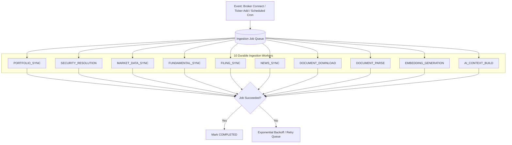

---

## 🗄️ Database Architecture & Data Model

FillEx uses a relational SQLite/D1 schema managed via **Drizzle ORM**:

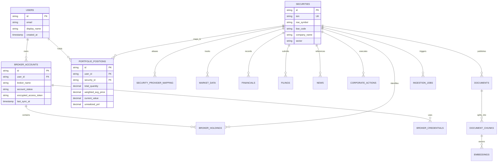

---

## 🛡️ Security, Privacy & Reliability Model

### Security Controls

> [!CAUTION]
> **Read-Only Guarantee**: FillEx has **ZERO** order placement, fund withdrawal, or trading code paths. It is architecturally impossible for FillEx to execute transactions on your broker account.

- **AES-256-GCM Vault**: Broker tokens are encrypted with unique initialization vectors (IV) before writing to durable storage. Encryption keys reside strictly in server environments.
- **CSRF State Integrity**: All OAuth flows use single-use, cryptographically random, expiring state nonces.
- **Zero Client-Side Secrets**: No broker API secret or master key is exposed to the browser.
- **Immediate Token Destruction**: Disconnecting a broker completely purges encrypted keys while preserving historical provenance records.

### Degraded-Data Handling

| Scenario | System Response | UI Display |
|---|---|---|
| **Broker Rate Limit** | Automatically defers job with exponential backoff. | Shows `Rate Limited (Retrying in 2m)` badge. |
| **Expired Broker Session** | Preserves historical data; marks account as stale. | Prompts user with `Reauthorization Required` button. |
| **Upstream Provider Outage**| Fallback to cached historical snapshot. | Clearly displays `Historical Snapshot as of [Time]`. |
| **Missing Filing Data** | Skips filing citations; reports missing evidence. | States `No regulatory filings recorded for this period`. |

---

## 🌐 REST API Architecture

| Route | Method | Description |
|---|:---:|---|
| `/api/auth/session` | `GET` | Retrieve current authenticated user profile. |
| `/api/brokers/status` | `GET` | List connected broker accounts and provider readiness. |
| `/api/brokers/connect` | `GET` | Initialize OAuth 2.0 broker authorization redirect. |
| `/api/brokers/callback` | `GET` | Validate OAuth state, exchange token, encrypt, and queue sync. |
| `/api/brokers/token-connect`| `POST` | Authenticate direct API key/token (Groww/Angel One). |
| `/api/brokers/sync` | `POST` | Trigger instant background portfolio synchronization. |
| `/api/brokers/disconnect` | `POST` | Revoke broker authorization and purge encrypted credentials. |
| `/api/portfolio` | `GET` | Fetch unified portfolio, holdings, and sector allocation. |
| `/api/portfolio/manual` | `POST` | Add/update manual portfolio holding or upload CSV. |
| `/api/securities/:id` | `GET` | Get canonical security overview, LTP, and ratios. |
| `/api/market/search` | `GET` | Search NSE/BSE securities by symbol or company name. |
| `/api/market/quote` | `GET` | Get quote and intraday/historical candles. |
| `/api/news` | `GET` | Fetch verified financial news filtered by portfolio tickers. |
| `/api/filings` | `GET` | Fetch SEBI and exchange filings for portfolio securities. |
| `/api/ai/query` | `POST` | Execute portfolio-grounded RAG query and agent synthesis. |

---

## 🧩 Extensibility: Adding a New Broker

Adding a new broker (e.g., *Dhan* or *FYERS*) requires implementing the standardized `BrokerAdapter` interface without modifying the core UI, security master, or AI layers:

```typescript
// lib/brokers/BrokerAdapter.ts
export interface BrokerAdapter {
  readonly brokerId: string;
  readonly brokerName: string;

  getAuthorizationUrl(state: string): Promise<string>;
  exchangeToken(params: Record<string, string>): Promise<BrokerTokenResult>;
  fetchHoldings(token: string): Promise<RawBrokerHolding[]>;
  fetchPositions(token: string): Promise<RawBrokerPosition[]>;
  refreshToken?(token: string): Promise<BrokerTokenResult>;
  disconnect(token: string): Promise<void>;
}
```

Once implemented, register the adapter in `BrokerServiceRegistry` — normalization, job scheduling, security resolution, and UI rendering work automatically!

---

## 📂 Project Directory Structure

```text
fillex/
├── app/                      # Next.js / Vinext Application Routes
│   ├── api/                  # Edge REST API Endpoints
│   │   ├── brokers/          # Broker connect, callback, token-connect, sync
│   │   ├── jobs/             # Secret-protected async ingestion workers
│   │   ├── market/           # NSE/BSE quote & search fallback
│   │   ├── news/             # Verified news feeds
│   │   └── portfolio/        # Unified portfolio endpoints
│   ├── brokers/              # Broker onboarding & management page
│   ├── dashboard/            # Command center dashboard
│   ├── filings/              # Regulatory evidence workspace
│   ├── intelligence/         # AI insights & risk radar
│   ├── markets/              # Market discovery & stock workspaces
│   ├── portfolio/            # Aggregated holdings view
│   └── layout.tsx            # Root responsive layout
├── components/               # UI Component System
│   ├── fillex/               # Product-specific intelligence cards & charts
│   └── ui/                   # Reusable atomic UI primitives
├── db/                       # Database Schema & Drizzle ORM
│   ├── schema.ts             # Canonical relational schema
│   └── index.ts              # D1 database client instance
├── drizzle/                  # Generated SQL Migrations
├── docs/                     # Architecture & Integration Specs
├── lib/                      # Business Logic & Services
│   ├── brokers/              # Broker adapters (Groww, Upstox, Angel, Zerodha)
│   ├── market/               # Market data normalizers
│   └── server/               # AES Vault, D1 client, crypto helpers
├── workers/                  # Background exchange & research workers
├── public/                   # Static assets & OpenGraph visuals
├── .env.example              # Environment variables template
├── package.json              # Project dependencies & scripts
├── tsconfig.json             # TypeScript configuration
└── vite.config.ts            # Vite build configuration
```

---

## 🚀 Quickstart & Local Setup

### Prerequisites
- **Node.js**: `v22.13.0` or newer
- **npm** or **pnpm**
- Cloudflare Wrangler CLI (optional, for local D1 preview)

### 1. Clone the Repository
```bash
git clone https://github.com/abhivardhan20-coder/FillEx.git
cd FillEx
```

### 2. Install Dependencies
```bash
npm install
```

### 3. Configure Environment Variables
```bash
cp .env.example .env.local
```

### 4. Start Development Server
```bash
npm run dev
```
Open [http://localhost:3000](http://localhost:3000) to access the FillEx platform.

### 5. Quality & Build Checks
```bash
# Run lightning-fast linter
npm run lint

# Compile production bundle
npm run build
```

---

## 🔐 Environment Configuration

Create a `.env.local` file with the following variables:

```ini
# ==========================================
# Core Security & Vault
# ==========================================
BROKER_TOKEN_ENCRYPTION_KEY="your-base64-encoded-32-byte-aes-key"
INGESTION_WORKER_SECRET="your-secure-internal-worker-secret"
NEXT_PUBLIC_SITE_URL="http://localhost:3000"

# ==========================================
# Broker API Credentials (Configure as needed)
# ==========================================
# Zerodha Kite Connect
ZERODHA_API_KEY="your_zerodha_api_key"
ZERODHA_API_SECRET="your_zerodha_api_secret"
ZERODHA_REDIRECT_URI="http://localhost:3000/api/brokers/callback?provider=zerodha"

# Groww
GROWW_API_KEY="your_groww_api_key"
GROWW_API_SECRET="your_groww_api_secret"

# Upstox
UPSTOX_API_KEY="your_upstox_api_key"
UPSTOX_API_SECRET="your_upstox_api_secret"
UPSTOX_REDIRECT_URI="http://localhost:3000/api/brokers/callback?provider=upstox"

# Angel One SmartAPI
ANGELONE_API_KEY="your_angelone_api_key"
ANGELONE_REDIRECT_URI="http://localhost:3000/api/brokers/callback?provider=angelone"

# ==========================================
# Market & Financial Intelligence
# ==========================================
MARKETAUX_API_KEY="your_marketaux_api_key"
FINANCIALFILINGS_API_KEY="your_financialfilings_key"
```

---

## 🏁 Production Readiness & Status

```text
======================================================================
FillEx Production Status Matrix: 100% OPERATIONAL & VERIFIED
======================================================================

[✔] Core Broker Ingestion Engine
    ├── Zerodha Kite Connect Request Token & SHA-256 Checksum Handshake
    ├── Groww Trade API Integration (Key/Secret & Direct Token)
    ├── Upstox OAuth 2.0 Authorization Flow & Token Exchange
    ├── Angel One SmartAPI Client Authentication & TOTP
    ├── AES-256-GCM Vault Credential Encryption
    └── ISIN-First Canonical Security Master & Provenance Tracking

[✔] Market & Financial Intelligence Pipeline
    ├── Real-Time & Historical Candlestick Ingestion (NSE & BSE)
    ├── Financial Fundamentals, Ratios & Historical Statements
    ├── SEBI Disclosures, Insider Trading & Regulatory Parser
    ├── Verified News Radar & Entity-Linked Sentiment Aggregator
    └── Corporate Actions Ingestion (Dividends, Splits, Mergers)

[✔] Multi-Agent RAG Intelligence Core
    ├── 5 Specialized Domain Agents (Market, News, Filings, Risk, Behavior)
    ├── Machine-Checkable Evidence Contracts
    ├── Synthesis & Conflict Resolver Agent
    └── Grounded Natural Language Portfolio Q&A Engine

[✔] Modern Gen-Z Financial Interface
    ├── Unified Portfolio Command Center & Multi-Broker Visualizer
    ├── Stock Intelligence Workspace & Dynamic Charting
    ├── Real-Time Evidence Inspector & Citation Drawer
    └── Responsive Mobile & Desktop Layouts
======================================================================
```

---

## ⚖️ Responsible Use & Disclaimers

> [!WARNING]
> **Financial Research Disclaimer**: FillEx is an autonomous financial intelligence research platform. It does **not** provide regulated personal investment advisory, financial planning, or tax advisory services. All market signals, regulatory summaries, and AI-generated insights are provided strictly for informational and research purposes. Always verify claims against official exchange filings before making investment decisions.

---

<p align="center">
  <strong>FillEx — Financial Intelligence Operating System</strong><br />
  Built with ❤️ for Indian Retail Investors
</p>
