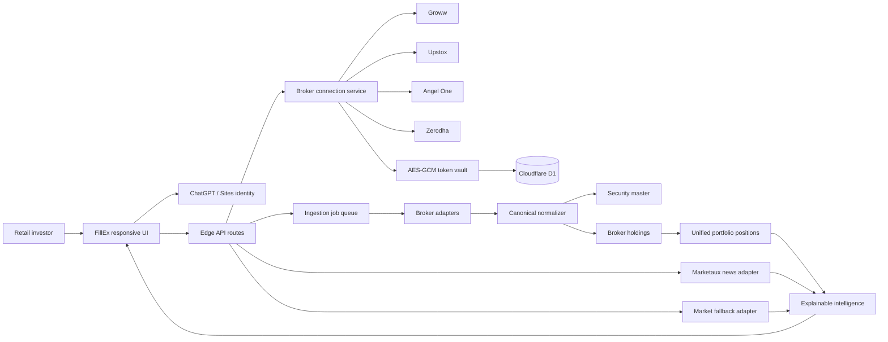
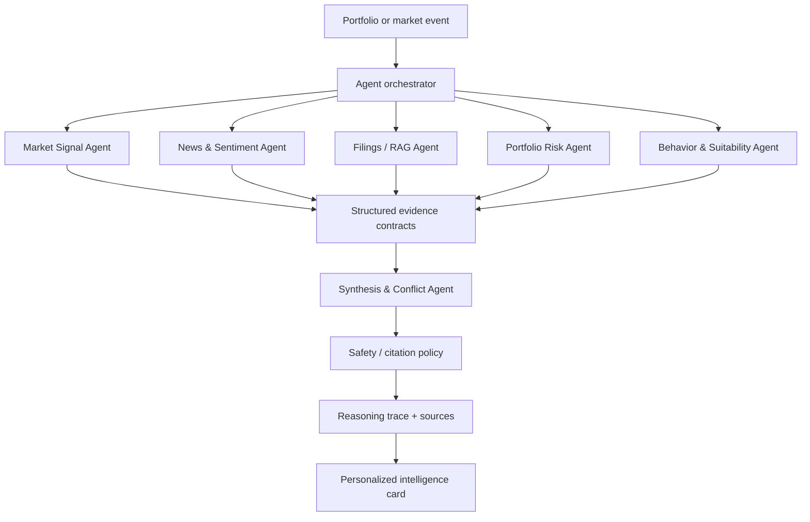

<p align="center">
  
</p>

<h1 align="center">FillEx</h1>

<p align="center">
  <strong>Know what changed. Know why it matters.</strong><br />
  Explainable, portfolio-aware financial intelligence for Indian retail investors.
</p>

<p align="center">
  <a href="https://fillex-intelligence.whole-skink-3843.chatgpt.site/">Hosted App</a>
  ·
  <a href="#-90-second-judge-demo">Judge Demo</a>
  ·
  <a href="#-architecture">Architecture</a>
  ·
  <a href="#-implementation-status">Implementation Status</a>
  ·
  <a href="#-roadmap-to-the-full-vision">Roadmap</a>
</p>

<p align="center">
  
  
  
  
  
</p>

---

## The problem

India does not have a financial-data shortage. It has a **decision-intelligence gap**.

Retail investors are forced to assemble a fragmented picture from broker apps, price charts, exchange announcements, regulatory filings, news feeds, social media, and spreadsheets. Most products solve one slice of that workflow. Very few connect the slices, personalize them to the investor's actual portfolio, and preserve the evidence behind every conclusion.

**FillEx turns the portfolio into the query.**

Instead of asking users to research every company manually, FillEx discovers what they own, imports real broker data, resolves securities into a canonical identity, gathers relevant context, and exposes only the intelligence supported by available evidence.

> The goal is not another stock-tip engine. The goal is an auditable research system that knows when it has enough evidence - and knows when it does not.

FillEx is built for **Hackverse PS-01: Multi-Agent Autonomous Financial Intelligence System for Retail Investors**.

---

## Why now

The Hackverse problem context highlights three brutal facts:

- **89% of Indian retail F&O participants lose money.**
- India added **130 million retail investors in four years**.
- Roughly **80% of those new investors are under 30**.

Institutional desks compare fundamentals, filings, technicals, sentiment, macro conditions, and portfolio risk before acting. A first-time investor usually gets a chart, a notification, and an opinion. FillEx attacks that infrastructure asymmetry directly.

---

## Why FillEx stands out

### 1. Portfolio-driven intelligence

The user's holdings determine which companies and events matter. A newly discovered security is normalized, added to the security master, and queued for enrichment automatically.

### 2. Real inputs, never theatrical demo data

FillEx does not preload fake portfolios, prices, filings, news, signals, or citations. Missing data produces an explicit unavailable, pending, stale, or reauthorization state.

### 3. Evidence before narrative

Every provider is labeled. Broker provenance is preserved. Fallback market data is never described as exchange-live. Future AI conclusions are designed to carry source, document, page, event time, and evidence strength.

### 4. Secure broker-first onboarding

Users connect through supported broker authorization mechanisms. FillEx requests portfolio access only and has no trade-placement code path. Tokens are encrypted server-side and are never persisted in browser storage.

### 5. Built for graceful degradation

A missing filing provider does not break the portfolio. A broker rate limit schedules a retry. An expired token requests reauthorization. A disconnected broker stops future sync while preserving historical provenance.

### 6. A production-shaped architecture

The system already separates the edge-hosted product, durable data, ingestion jobs, broker adapters, and isolated exchange research workers. New brokers and data providers plug into defined boundaries instead of leaking provider-specific logic across the UI.

---

## 90-second judge demo

1. **Open FillEx** and land on the source-first product story.
2. **Sign in with ChatGPT** to establish a stable, isolated user identity.
3. Open **Broker accounts** and connect Groww or start the Upstox authorization flow.
4. FillEx validates authorization, encrypts the token, queues a background portfolio sync, and keeps the UI usable.
5. Open **Portfolio** to see canonical, unified holdings with broker provenance and last-source timestamps.
6. Open **Intelligence** to see:
   - portfolio concentration calculated from broker-reported invested value;
   - risk thresholds adapted to conservative, balanced, or growth profiles;
   - live Marketaux stories filtered for India or an NSE ticker;
   - entity-level sentiment context and direct source links.
7. Open **Markets** to search NSE/BSE securities through the clearly labeled no-key fallback.
8. Disconnect the broker and show that tokens are destroyed, future sync stops, and historical records remain attributable.

### The end-to-end story

```text
Broker authorization
        -> encrypted token storage
        -> async portfolio job
        -> holdings + positions fetch
        -> canonical security resolution
        -> multi-broker aggregation
        -> portfolio-aware risk context
        -> verified news context
        -> explainable user interface
```

---

## Product surfaces

| Route | Purpose | Data behavior |
|---|---|---|
| `/` | Product landing page | Explains FillEx, source policy, and trust model |
| `/dashboard` | Workspace command center | Directs users to real portfolio, market, and evidence sources |
| `/brokers` | Broker onboarding and account management | Connect, refresh, reauthorize, and disconnect accounts |
| `/onboarding/broker` | Broker-first onboarding entry | Reuses the secure connection flow |
| `/portfolio` | Unified portfolio workspace | Broker-imported positions plus optional browser-local manual holdings |
| `/markets` | NSE/BSE discovery and quote workspace | Real fallback results with explicit source labeling |
| `/intelligence` | Explainable portfolio and news context | Deterministic risk checks plus verified Marketaux coverage |
| `/filings` | Evidence workspace | Honest empty states until official/licensed filing sources are connected |
| `/integrations` | Provider control plane | Shows exactly which production and research sources are ready |

The application is responsive across desktop, tablet, and mobile, uses accessible labels and semantic controls, and avoids relying on color alone for portfolio outcomes.

---

## What is implemented

### Broker connection and portfolio ingestion

- Broker-first onboarding for **Groww, Upstox, Angel One, and Zerodha**.
- Groww API-key/secret approval flow with server-side access-token generation.
- Groww direct access-token fallback for user-generated tokens.
- Upstox OAuth authorization-code flow and backend token exchange.
- Zerodha request-token flow with SHA-256 checksum exchange.
- Angel One publisher-login callback support.
- CSRF-resistant, expiring OAuth state records.
- Signed-in user ownership checks on every broker mutation.
- AES-256-GCM token encryption with a random IV per ciphertext.
- Read-only portfolio fetchers for holdings and positions.
- Automatic token renewal path for Groww.
- User-triggered refresh and background job dispatch.
- Retry handling for rate limits and transient upstream failures.
- Explicit account states: connected, sync failed, rate limited, reauthorization required, and disconnected.
- Disconnect destroys stored tokens while preserving historical holdings and provenance.

### Canonical portfolio model

- ISIN-first security identity when an ISIN is supplied.
- Exchange-symbol fallback identity when an ISIN is unavailable.
- Provider instrument mapping for broker-specific identifiers.
- Canonical normalization of symbol, exchange, quantity, average price, last price, invested value, current value, unrealized P&L, realized P&L, T1 quantity, pledged quantity, and product type.
- Multi-broker aggregation into a single user/security position.
- Weighted average-price calculation across connected accounts.
- Source broker and source timestamp retained for every holding.
- Automatic `SECURITY_DISCOVERY` jobs for newly observed securities.

### Verified news intelligence

- Server-side Marketaux integration; the API token never reaches the browser.
- India-linked financial news feed.
- NSE ticker filtering with normalized `.NS` symbols.
- Provider-returned entity mapping and sentiment aggregation.
- Source article links, publication timestamps, entity badges, and neutral/positive/negative context.
- Clear empty, loading, rate-limit, unavailable, and failure states.

### Explainable portfolio analysis

- Cost-basis concentration analysis using broker-reported invested value when available.
- Manual holding fallback using quantity × average price.
- Conservative, balanced, and growth risk profiles.
- Transparent formula, input coverage, assessed-position count, threshold, and largest contributor.
- Broker-confirmed and manual positions can participate in the same analysis.
- No investment recommendation is inferred from missing evidence.

### Market discovery

- NSE and BSE search and quote routes.
- Yahoo Finance-compatible fallback adapted from the open-source Indian Stock Market API pattern.
- Fallback is explicitly labeled and never presented as a zero-delay licensed feed.
- Input normalization and upstream-unavailable handling.

### Manual portfolio fallback

- Manual NSE/BSE holding entry.
- CSV import with validation.
- Browser-local persistence for deliberately device-local manual records.
- No server upload of a manual CSV in the current implementation.
- No placeholder holdings inserted under any circumstance.

### Reliability and product truthfulness

- Non-blocking sync UX.
- Durable ingestion-job states and attempt counts.
- Two-minute retry scheduling and stale-worker recovery.
- Provider-specific authorization, rate-limit, and upstream error classification.
- Generic client-safe errors; secrets and provider payloads are not logged.
- Explicit setup-required states when configuration is incomplete.
- Existing portfolio history remains usable during most external-source failures.

---

## Architecture



### Portfolio ingestion sequence

```mermaid
sequenceDiagram
    actor User
    participant UI as FillEx UI
    participant API as Broker API route
    participant Broker
    participant DB as D1
    participant Worker as Portfolio worker

    User->>UI: Select broker
    UI->>API: Start authorization
    API->>DB: Save expiring CSRF state
    API-->>User: Redirect to official broker flow
    Broker-->>API: Authorization callback
    API->>Broker: Exchange temporary code/token
    API->>API: Encrypt access token
    API->>DB: Save broker account + queue sync
    API-->>UI: Connected; sync running
    Worker->>Broker: Fetch holdings + positions
    Worker->>Worker: Normalize identifiers and values
    Worker->>DB: Upsert securities and holdings
    Worker->>DB: Rebuild unified positions
    Worker->>DB: Queue discovery for new securities
    UI->>DB: Read portfolio and job status
```

### Source precedence

```text
1. Official broker or licensed live-feed API
2. NSE / BSE / SEBI / company investor relations
3. Licensed filing and verified news providers
4. Explicitly labeled open-source fallback and research workers
```

This hierarchy is a product rule, not a suggestion. Lower-priority sources cannot silently masquerade as higher-quality evidence.

---

## Data model

| Table | Responsibility |
|---|---|
| `users` | Stable Sites-authenticated user identity |
| `broker_accounts` | Broker ownership, encrypted tokens, expiry, connection state, and sync time |
| `oauth_states` | Short-lived, one-time authorization state validation |
| `securities` | Canonical ISIN/symbol/company identity shared across providers |
| `security_provider_mapping` | Broker-specific instrument ID to canonical security mapping |
| `broker_holdings` | Source-level holdings and positions with complete provenance |
| `portfolio_positions` | User-level, multi-broker aggregated positions |
| `ingestion_jobs` | Durable discovery, fetching, retry, completion, and failure state |

The database uses indexes for user/status, security lookup, provider instruments, and job priority. The generated migration ships with `PRAGMA optimize` for SQLite query planning.

---

## API surface

| Endpoint | Method | Responsibility |
|---|---:|---|
| `/api/brokers/status` | GET | Provider readiness and signed-in account status |
| `/api/brokers/connect` | GET | Start redirect-based broker authorization |
| `/api/brokers/callback` | GET | Validate state, exchange token, encrypt, and queue sync |
| `/api/brokers/token-connect` | POST | Verify and encrypt a Groww access token or generate one server-side |
| `/api/brokers/sync` | POST | Queue a refresh for one or all connected accounts |
| `/api/brokers/disconnect` | POST | Revoke local access and preserve historical provenance |
| `/api/jobs/portfolio-sync` | POST | Secret-protected background portfolio job consumer |
| `/api/portfolio` | GET | Unified positions, account states, and job summary for the current user |
| `/api/news` | GET | Verified Marketaux news, optionally filtered by ticker |
| `/api/market/search` | GET | NSE/BSE security search through the labeled fallback |
| `/api/market/quote` | GET | NSE/BSE fallback quote retrieval |

---

## Security model

### What FillEx can do

- Read holdings and positions authorized by the user.
- Refresh portfolio state.
- Build portfolio-level analysis from authorized data.

### What FillEx cannot do

- Place, modify, or cancel orders.
- Withdraw funds.
- Transfer securities.
- Read a user's broker password, PIN, or TOTP from the FillEx interface.
- Expose provider secrets through `NEXT_PUBLIC_*` variables.

### Defensive controls

- **Authentication:** stable Sites identity from trusted request headers.
- **Authorization:** every account query and mutation is scoped to the signed-in user ID.
- **Token protection:** AES-256-GCM encryption at rest; encryption keys remain outside the database.
- **OAuth integrity:** random, expiring, single-use state bound to user and provider.
- **Secret isolation:** secrets live in ignored local environment files or the hosting secret store, never the repository.
- **Least privilege:** portfolio access only; no trading endpoints are implemented.
- **Safe errors:** clients receive controlled error codes rather than tokens or raw upstream payloads.
- **Disconnect semantics:** encrypted tokens are destroyed immediately; historical source records remain auditable.
- **Data honesty:** missing or delayed providers produce explicit states instead of fabricated output.

> Credentials pasted into chat, issue trackers, recordings, or screenshots must be rotated before production use.

---

## Implementation status

Legend: **✅ implemented** · **🟡 partial/scaffolded** · **⬜ planned**

### Hackverse PS-01 requirement mapping

| Requirement | Status | FillEx implementation |
|---|:---:|---|
| Live or near-real-time market source | 🟡 | Real NSE/BSE fallback is active and clearly labeled; licensed streaming feed remains credential-gated |
| Regulatory/financial document corpus | 🟡 | Filing surface and provider hierarchy exist; official document ingestion and storage are next |
| Semantic/vector retrieval | ⬜ | Evidence-preserving RAG architecture is specified below |
| Three or more specialized agents | ⬜ | Agent contracts and synthesis design are specified below; runtime orchestration is next |
| User risk profiling | 🟡 | Conservative/balanced/growth risk parameters affect concentration output; behavioral history is next |
| Live interface for portfolio and signals | ✅ | Responsive portfolio, market, news, provider, and intelligence surfaces |
| Signal classification across three dimensions | 🟡 | Portfolio concentration and entity sentiment work; momentum and volume anomaly agents are next |
| Source attribution | ✅ | Broker provenance, timestamps, Marketaux sources, article links, and fallback labels are visible |
| Performance log with measurable metrics | 🟡 | Job attempts/status/timing foundations exist; session accuracy/latency evaluation tables are next |
| End-to-end raw ingestion demo | ✅ | Groww authorization -> holdings -> normalization -> D1 -> portfolio -> risk/news intelligence |
| Graceful degraded-data scenario | ✅ | Missing credentials, rate limits, expired authorization, unavailable feeds, and empty evidence are handled |
| Written architecture and decision logic | ✅ | This README plus `docs/integration-architecture.md` |

This matrix is intentionally honest. Judges can distinguish a working system from a slide-deck claim, and FillEx makes that distinction part of its product philosophy.

---

## Multi-agent intelligence design

The secure ingestion and evidence foundation is already in place. The next competition layer runs specialized agents in parallel and allows the synthesis layer to consume only structured, attributable outputs.



### Agent contracts

Every agent returns a machine-checkable object instead of free-form prose:

```ts
type AgentEvidence = {
  agent: 'market' | 'news' | 'filings' | 'risk' | 'behavior';
  securityId: string;
  classification: string;
  direction: 'positive' | 'negative' | 'neutral' | 'unclear';
  confidence: number;
  impact: 'high' | 'medium' | 'low' | 'unknown';
  horizon: 'intraday' | 'near-term' | 'long-term' | 'unknown';
  evidence: Array<{
    source: string;
    sourceUrl?: string;
    timestamp?: string;
    documentId?: string;
    page?: number;
  }>;
  limitations: string[];
};
```

### Proposed specialized roles

- **Market Signal Agent** - momentum, volume anomaly, volatility, liquidity, and freshness classification.
- **News & Sentiment Agent** - entity resolution, duplicate-event grouping, impact, sentiment, and time horizon.
- **Filings / RAG Agent** - retrieves official evidence, cites page-level chunks, and extracts material changes.
- **Portfolio Risk Agent** - concentration, sector exposure, drawdown sensitivity, and contributor analysis.
- **Behavior & Suitability Agent** - adapts explanation and risk framing to stored user preferences and behavior.
- **Synthesis & Conflict Agent** - weighs conflicting evidence, refuses unsupported conclusions, and produces the final trace.

The synthesis layer never receives hidden chain-of-thought. It receives compact classifications, calculations, citations, limitations, and confidence metadata that can be displayed and evaluated safely.

---

## Planned RAG and document pipeline

```text
NSE / BSE / SEBI / company IR / licensed provider
        -> document discovery
        -> immutable original in object storage
        -> PDF/HTML/XLS validation
        -> text + table extraction
        -> OCR when required
        -> classification and metadata
        -> page-aware chunking
        -> embeddings
        -> vector retrieval
        -> cited agent evidence
```

Every retrievable chunk will preserve:

```text
document_id · security_id · source · source_url · filing_type
filing_date · document_date · page_number · section · chunk_id
```

That metadata is what lets FillEx say *why* an answer exists, not merely produce an answer.

---

## Integrations

### Active in the current build

| Provider | Role | State |
|---|---|---|
| Groww Trading API | Broker holdings and positions | Connected through key/secret approval or access token |
| Upstox | OAuth broker portfolio adapter | Implemented; requires registered callback and user authorization |
| Marketaux | Verified financial news and entity sentiment | Connected |
| Yahoo Finance-compatible fallback | NSE/BSE search and quotes | Active, labeled fallback |
| ChatGPT / Sites identity | User authentication and isolation | Active |
| Cloudflare D1 | Durable broker, security, portfolio, and job state | Active in hosted deployment |

### Adapter-ready or credential-gated

| Provider | Planned role |
|---|---|
| Angel One SmartAPI | Broker portfolio and potential live market feed |
| Zerodha Kite Connect | Broker portfolio, instruments, historical data, and streaming |
| FinancialFilings | Licensed financial filing ingestion |
| NewsAPI / GNews | Secondary verified news and redundancy |
| StockerAPI / Kun Data | Streaming OHLCV and screening feed |

### Isolated open-source research layer

- [`0xramm/Indian-Stock-Market-API`](https://github.com/0xramm/Indian-Stock-Market-API) - prototype search/quote pattern via Yahoo Finance.
- [`bshada/nse-bse-api`](https://github.com/bshada/nse-bse-api) - Node research worker for NSE/BSE data.
- [`BennyThadikaran/NseIndiaApi`](https://github.com/BennyThadikaran/NseIndiaApi) - rate-limited Python NSE research worker.
- [`BennyThadikaran/BseIndiaApi`](https://github.com/BennyThadikaran/BseIndiaApi) - isolated GPL-3.0 BSE research worker.
- [`StockerAPI/india-stock-market-api`](https://github.com/StockerAPI/india-stock-market-api) - streaming provider specification; runtime access remains token-gated.

These repositories support research and fallback infrastructure. They are not treated as the financial source of truth.

---

## Technology stack

| Layer | Technology |
|---|---|
| Product UI | React 19, TypeScript, Vinext routing |
| Design system | Tailwind CSS, shadcn components, Base UI, Lucide icons |
| Edge runtime | Cloudflare Workers-compatible ESM |
| Hosting | OpenAI Sites |
| Durable database | Cloudflare D1 / SQLite |
| Schema | Drizzle ORM + generated SQL migration |
| Identity | ChatGPT / Sites authenticated-user headers |
| Token encryption | Web Crypto AES-256-GCM |
| Broker integrations | Native `fetch` adapters with normalized contracts |
| Verified news | Marketaux REST API |
| Charts / visualization | Recharts-ready component stack |
| Validation | Vinext production build + Oxlint |

Why this stack:

- edge-compatible and fast to ship;
- no raw TCP dependency in the hosted path;
- secure server-side secrets;
- durable relational ownership and provenance;
- small adapter surface for rapid provider expansion;
- one TypeScript codebase from UI to ingestion.

---

## Run locally

### Prerequisites

- Node.js `22.13.0` or newer
- npm
- Broker/news credentials only for the providers you want to activate

### Installation

```bash
git clone <your-repository-url>
cd app
npm install
```

Create `.env.local` from the provided template:

```bash
cp .env.example .env.local
```

Start FillEx:

```bash
npm run dev
```

Open [http://localhost:3000](http://localhost:3000).

### Quality checks

```bash
npm run lint
npm run build
```

---

## Environment variables

Never prefix private credentials with `NEXT_PUBLIC_`.

### Core security

| Variable | Required | Description |
|---|:---:|---|
| `BROKER_TOKEN_ENCRYPTION_KEY` | Broker flows | Base64-encoded 32-byte AES key |
| `INGESTION_WORKER_SECRET` | Broker flows | Secret protecting background worker execution |
| `NEXT_PUBLIC_SITE_URL` | Recommended | Trusted site origin used by metadata and callbacks |

Generate local security values with a cryptographically secure random source. Do not reuse example values from documentation.

### Groww

| Variable | Description |
|---|---|
| `GROWW_API_KEY` | Groww Trading API key used for approved token generation |
| `GROWW_API_SECRET` | Groww checksum secret |
| `GROWW_ACCESS_TOKEN` | Optional direct user-generated token alternative |

### Upstox

| Variable | Description |
|---|---|
| `UPSTOX_API_KEY` | OAuth client ID |
| `UPSTOX_API_SECRET` | OAuth client secret |
| `UPSTOX_REDIRECT_URI` | Exact registered callback ending in `?provider=upstox` |

### Angel One

| Variable | Description |
|---|---|
| `ANGELONE_API_KEY` | SmartAPI publisher key |
| `ANGELONE_REDIRECT_URI` | Registered publisher callback |
| `ANGELONE_CLIENT_LOCAL_IP` | SmartAPI-required client network metadata |
| `ANGELONE_CLIENT_PUBLIC_IP` | SmartAPI-required public IP metadata |
| `ANGELONE_MAC_ADDRESS` | SmartAPI-required device metadata |

### Zerodha

| Variable | Description |
|---|---|
| `ZERODHA_API_KEY` | Kite Connect API key |
| `ZERODHA_API_SECRET` | Kite Connect API secret |
| `ZERODHA_REDIRECT_URI` | Registered callback ending in `?provider=zerodha` |

### Intelligence and data providers

| Variable | Provider |
|---|---|
| `MARKETAUX_API_KEY` | Marketaux verified financial news |
| `FINANCIALFILINGS_API_KEY` | FinancialFilings document provider |
| `NEWSAPI_KEY` | NewsAPI secondary feed |
| `GNEWS_API_KEY` | GNews secondary feed |
| `STOCKER_API_TOKEN` | StockerAPI / Kun Data streaming feed |

The complete empty template is available in [`.env.example`](./.env.example).

---

## Project structure

```text
app/
├── app/
│   ├── api/
│   │   ├── brokers/          # Authorization, token connection, sync, disconnect
│   │   ├── jobs/             # Secret-protected background ingestion
│   │   ├── market/           # NSE/BSE fallback search and quotes
│   │   ├── news/             # Marketaux adapter route
│   │   └── portfolio/        # Unified user portfolio API
│   ├── brokers/              # Broker-first onboarding UI
│   ├── portfolio/            # Connected and manual portfolio workspace
│   ├── intelligence/         # Risk and verified-news intelligence
│   ├── markets/              # Market discovery
│   ├── filings/              # Evidence workspace
│   └── integrations/         # Provider readiness control plane
├── components/
│   ├── fillex/               # Product-specific components
│   └── ui/                   # Reusable interface primitives
├── db/schema.ts              # Canonical D1 schema
├── drizzle/                  # Generated, deployable SQLite migration
├── lib/
│   ├── brokers/              # Provider config, auth, adapters, normalization
│   ├── market/               # Market fallback implementation
│   └── server/               # D1, identity, encryption, worker dispatch
├── workers/
│   ├── node-market/          # Isolated Node exchange research
│   └── python-exchange/      # Isolated Python NSE/BSE research
└── docs/                     # Architecture notes
```

---

## Degraded-data behavior

| Failure | FillEx response |
|---|---|
| Missing broker credentials | Broker card shows setup required; authorization cannot start |
| Anonymous broker action | API returns sign-in required |
| Invalid/expired OAuth state | Callback fails safely without altering the existing portfolio |
| Expired broker token | Account becomes reauthorization required |
| Broker rate limit | Job is marked for retry and account shows rate-limited status |
| Temporary provider error | Bounded retries, then explicit sync-failed state |
| Missing filing provider | Filing UI remains available with a source-required state |
| No licensed live feed | Markets use a labeled fallback and never claim zero-delay prices |
| No portfolio | Intelligence explains what must be connected instead of inventing analysis |
| Broker disconnect | Future sync stops, tokens are destroyed, historical provenance is retained |

This is a direct answer to the hackathon requirement that one unavailable source must not crash the pipeline or produce uncited output.

---

## Roadmap to the full vision

### Phase 1 - Secure portfolio truth ✅

- Broker-first onboarding
- Encrypted tokens
- Groww and Upstox integration paths
- Angel One and Zerodha adapters
- Holdings/positions normalization
- Canonical security master
- Multi-broker aggregation
- Durable background jobs
- Manual/CSV fallback

### Phase 2 - Evidence and market depth 🟡

- Licensed WebSocket market feed and automatic provider failover
- Minute-to-month historical candles
- Volume, momentum, volatility, and liquidity features
- NSE/BSE/SEBI/company-IR filing collectors
- Corporate announcements and corporate actions
- R2 storage for original documents
- OCR and table extraction
- Page-aware vector retrieval
- News deduplication and event clustering
- Marketaux + GNews + exchange-announcement fusion

### Phase 3 - Multi-agent intelligence ⬜

- Parallel market, news, filings, risk, and behavior agents
- Structured agent output contracts
- Conflict-aware synthesis
- Evidence-strength and confidence calibration
- Full visible reasoning trace made from calculations and citations
- Portfolio-specific “why is it moving?” briefs
- Document Q&A with page-level attribution
- AI command bar for portfolio questions

### Phase 4 - Evaluation and continuous learning ⬜

- Session-level latency, coverage, and disagreement metrics
- 30-day forward-return signal evaluation
- Portfolio concentration and risk-change history
- Agent accuracy and citation-completeness dashboards
- Provider health, cost, quota, and freshness observability
- Dead-letter queues and circuit breakers
- Feedback capture without allowing feedback to rewrite source evidence

### Phase 5 - Product expansion ⬜

- Dhan and FYERS adapters
- Watchlists and alerts
- Stock detail pages with financials, filings, events, and peers
- Natural-language screeners
- RBI DBIE and FRED macro context
- Dividends, splits, bonuses, rights, buybacks, mergers, and demergers
- Contract-note/statement import
- Privacy-preserving notifications and exports

---

## Engineering decisions

### Why ISIN first?

Symbols differ across exchanges and providers. ISIN gives FillEx the strongest cross-provider identity for an Indian security. Provider tokens remain aliases, not the global primary key.

### Why preserve broker-level holdings after aggregation?

Aggregation is useful to the user; provenance is essential to trust. FillEx keeps both the unified position and its account-level sources so totals can be explained and recomputed.

### Why background jobs instead of blocking callbacks?

Broker callbacks should complete quickly and safely. Portfolio import, normalization, discovery, and downstream intelligence can continue asynchronously without trapping the user in a loading screen.

### Why deterministic risk analysis before generative AI?

Concentration is explainable, testable, and useful without an LLM. FillEx establishes a trustworthy baseline before layering AI over filings, market signals, and news.

### Why isolate the exchange research workers?

NSE/BSE libraries often assume Node or Python network behavior unsuitable for an edge runtime. Isolation also keeps the GPL-3.0 BSE dependency independently deployable and prevents it from contaminating the hosted UI bundle.

---

## Performance and evaluation plan

The completed evaluation layer will capture at least:

1. **Agent latency** - p50/p95 response time by specialized agent and synthesis.
2. **Evidence coverage** - percentage of claims with at least one valid source and timestamp.
3. **Citation correctness** - retrieved evidence that directly supports the associated claim.
4. **Signal outcome** - classification versus 1-day, 7-day, and 30-day forward returns.
5. **Agent disagreement** - frequency and severity of conflicting directions.
6. **Portfolio risk concentration** - before/after user or market events.
7. **Provider freshness** - event timestamp versus receipt timestamp.
8. **Degraded-mode success** - sessions completed safely despite an unavailable provider.

The existing ingestion-job table already records priority, state, attempts, start time, completion time, and safe failure context, providing the operational base for these metrics.

---

## Responsible-use policy

FillEx is a research and financial-intelligence platform. It does not guarantee returns, execute trades, or provide regulated personalized investment advice.

- AI output must distinguish evidence from interpretation.
- Uncertain causality must be described as possible, not certain.
- Confidence is meaningful only when calibrated against measured outcomes.
- Trading actions, if ever added, remain separated from AI analysis and require explicit user confirmation.
- Raw market data is never overwritten when corporate-action adjustments are introduced.
- Official sources outrank aggregators and open-source fallbacks.

---

## Hackathon pitch

> Portfolio trackers tell you what you own. News apps tell you what happened. Screeners tell you what moved. FillEx connects all three - then shows what the evidence actually means for *your* portfolio.

The winning idea is not “AI for stocks.” It is **an auditable decision layer for investors who cannot run a research desk**.

FillEx already proves the hardest foundation:

- real broker authorization;
- secure, canonical portfolio ingestion;
- background processing;
- verified live news;
- explainable personalization;
- graceful degraded-data behavior;
- an architecture ready for multi-agent evidence synthesis.

That makes FillEx more than a dashboard and more credible than a recommendation generator. It is the beginning of a personal financial-intelligence operating system.

---

<p align="center">
  <strong>FillEx</strong><br />
  Built for Hackverse: Into the Web · Sprint 1 · VIT Chennai · 2026
</p>
